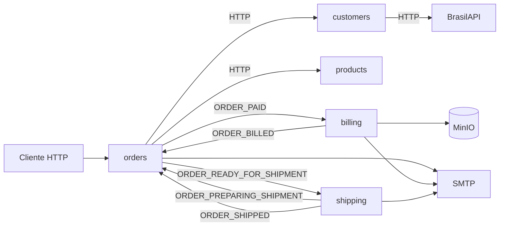

# Market Sphere 🌐

Market Sphere é um back-end de e-commerce distribuído em cinco microsserviços independentes. O projeto usa Java 21, Spring Boot 3.5.6, PostgreSQL e Apache Kafka para exercitar limites de domínio, comunicação orientada a eventos e entrega confiável com Transactional Outbox.

> Este é um projeto de estudo. Não há autenticação centralizada: apenas o webhook de pagamento e um endpoint interno de clientes verificam segredos compartilhados.

## Serviços

| Serviço | Responsabilidade | Estilo interno |
|---|---|---|
| [`customers`](customers/README.md) | Cadastro de clientes e resolução de endereço pela BrasilAPI | Orientado a recursos |
| [`products`](products/README.md) | Catálogo e disponibilidade de produtos | Orientado a recursos |
| [`orders`](orders/README.md) | Criação e ciclo de vida do pedido | Hexagonal + DDD |
| [`billing`](billing/README.md) | Geração, armazenamento e envio da nota fiscal | Hexagonal + DDD |
| [`shipping`](shipping/README.md) | Preparação e despacho da entrega | Package by feature |
| [`marketsphere-infra`](marketsphere-infra/README.md) | PostgreSQL, Kafka, Kafka UI, Zookeeper e MinIO locais | Docker Compose |

Cada serviço possui seu próprio banco. Não existem chaves estrangeiras entre domínios; dados necessários em outro serviço viajam como snapshots por HTTP ou eventos.

## Fluxo principal



O pedido nasce em `PAYMENT_PENDING`. A solicitação ao provedor de pagamento é simulada dentro de `orders`; a confirmação chega pelo webhook HTTP. Depois do pagamento, `orders`, `billing` e `shipping` coordenam faturamento e despacho por cinco eventos Kafka.

## Tecnologias

- Java 21 e Spring Boot 3.5.6;
- Spring Web, Spring Data JPA, Bean Validation e OpenFeign;
- Apache Kafka e Spring Kafka;
- PostgreSQL 17.6 no ambiente Docker local;
- MinIO e JasperReports para as notas fiscais;
- JavaMail para notificações;
- MapStruct e Lombok;
- JUnit 5, Mockito, ArchUnit e Testcontainers;
- GitHub Actions.

## Execução local

São necessários Java 21, Docker com Docker Compose e acesso a um servidor SMTP. Os projetos usam Maven Wrapper e carregam variáveis de arquivos `.env` localizados em `src/main/resources`; esses arquivos são ignorados pelo Git.

O repositório ainda não oferece um comando único de bootstrap. Os três Compose são independentes, os cinco bancos e seus schemas precisam ser preparados manualmente e o bucket do `billing` deve existir no MinIO. O procedimento fiel ao estado atual está em [Desenvolvimento local](docs/local-development.md).

Depois de configurar as dependências de um serviço:

```bash
cd orders
./mvnw spring-boot:run
```

Substitua `orders` pelo módulo desejado. As variáveis e dependências específicas estão no README de cada serviço.

## Documentação

- [Arquitetura](docs/architecture.md): domínios, dependências e estilos internos;
- [Transactional Outbox](docs/transactional-outbox.md): relays, leases, retentativas e idempotência;
- [Catálogo de eventos](docs/event-catalog.md): payloads e envelope Kafka;
- [Desenvolvimento local](docs/local-development.md): configuração e inicialização manual;
- [Testes e CI](docs/testing-and-ci.md): suítes e pipeline;
- [Infraestrutura local](marketsphere-infra/README.md): operação dos Compose.

## Testes e CI

Os cinco serviços são projetos Maven independentes, sem POM agregador. A CI executa `clean verify` em `orders`, `billing` e `shipping`; `customers` e `products` são compilados com os testes ignorados. `orders` e `billing` têm testes de arquitetura e integração com PostgreSQL real via Testcontainers.

Consulte [Testes e CI](docs/testing-and-ci.md) para os comandos e a cobertura efetiva de cada módulo.

## Contribuição

Contribuições podem ser propostas por issue ou pull request. Antes de enviar uma alteração, execute o `verify` do módulo afetado e mantenha os contratos HTTP e Kafka documentados.

## Licença

Distribuído sob a licença [MIT](LICENSE).

---

Copyright (c) 2025 João Leal
