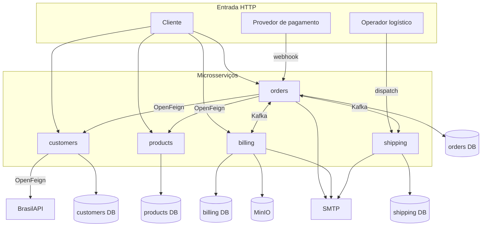
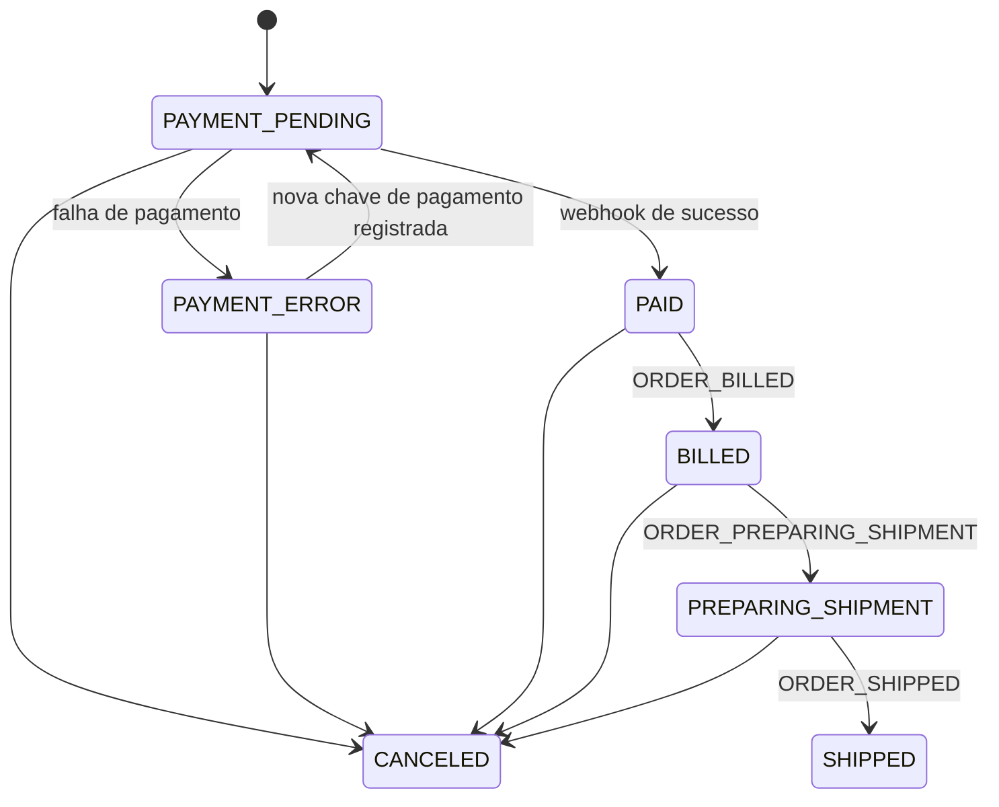

# Arquitetura

## Visão geral

Market Sphere separa clientes, produtos, pedidos, faturamento e entregas em cinco processos Spring Boot e cinco bancos PostgreSQL. Cada serviço é um projeto Maven independente e não há biblioteca de domínio compartilhada.

O "provedor de pagamento" do diagrama representa a borda do webhook. A solicitação de pagamento não chama um microsserviço bancário: o adaptador atual de `orders` gera uma resposta simulada em processo.

## Limites de domínio

| Domínio | Dado de autoridade | Integrações |
|---|---|---|
| `customers` | perfil, endereço e estado ativo do cliente | valida o CEP na BrasilAPI; serve dados de cliente a `orders` |
| `products` | nome, descrição, preço e disponibilidade | serve snapshots a `orders` |
| `orders` | pedido, itens, pagamento e estado comercial | consulta clientes/produtos; coordena eventos de faturamento e entrega |
| `billing` | nota fiscal e localização do PDF | consome pedido pago; usa JasperReports, MinIO e SMTP |
| `shipping` | preparação, despacho, transportadora e código de rastreio | consome pedido pronto; publica mudanças logísticas e envia e-mail |

Os bancos não possuem relacionamentos entre serviços. `orders` persiste snapshots do cliente e dos produtos necessários ao pedido. `billing` e `shipping` recebem seus snapshots nos eventos, evitando consultas síncronas durante o processamento Kafka.

## Estilos internos

| Serviço | Estilo | Estrutura observada |
|---|---|---|
| `orders` | Hexagonal + DDD | domínio sem dependência de infraestrutura; dentro de cada camada, pacotes por capability em vez de por estereótipo; adaptadores separados em `inbound` e `outbound` |
| `billing` | Hexagonal + DDD | agregado `Invoice`; dentro de cada camada, pacotes por capability em vez de por estereótipo; adaptadores separados em `inbound` e `outbound`, cobrindo Kafka, JPA, Jasper, MinIO e e-mail |
| `shipping` | Package by feature | `shipment`, `outbox`, `messaging`, `rest` e configuração sem camadas globais |
| `customers` | Orientado a recursos | controller, service, repository, model, mapper e client |
| `products` | Orientado a recursos | controller, service, repository, model e DTOs |

ArchUnit verifica as fronteiras hexagonais de `orders` e `billing`. Não há regra equivalente em `shipping`, `customers` ou `products`.

## Comunicação

### HTTP síncrono

- `orders` consulta `customers` e `products` por OpenFeign antes de persistir um pedido;
- `customers` consulta `/cep/v2/{cep}` da BrasilAPI ao criar ou alterar endereço, apenas para verificar que o CEP existe;
- `customers` expõe uma API interna em `/customers/internal` que consulta cliente ativo ou inativo e lista clientes. Ela não exige credencial, e `orders` não a consome: a criação de pedido usa o endpoint público e o detalhe do pedido lê os snapshots. Nenhum header de autenticação viaja entre `orders` e `customers`;
- o webhook de `orders` exige `X-Webhook-Secret`;
- `shipping` recebe o comando de despacho por HTTP;
- `billing` redireciona a consulta do documento para uma URL temporária do MinIO.

Não existe Spring Security nem autenticação comum para os endpoints públicos.

### Kafka assíncrono

`orders`, `billing` e `shipping` trocam cinco eventos JSON. Os nomes dos tópicos são configuráveis, e `orderId` é sempre a record key para preservar a ordem por pedido. A entrega é at-least-once; os consumidores tornam reentregas inócuas verificando o estado do agregado ou sua existência.

Consulte o [catálogo de eventos](event-catalog.md) e os detalhes do [Transactional Outbox](transactional-outbox.md).

## Ciclos de vida

### Pedido

Não há transição direta de `PAYMENT_ERROR` para `PAID`. A confirmação só é aceita a partir de `PAYMENT_PENDING`; registrar uma nova chave de pagamento é o que devolve o pedido a esse estado e torna a confirmação possível.

O código de domínio impede cancelar um pedido já enviado. A API atual não expõe endpoint de cancelamento; a transição existe no agregado.

### Nota fiscal e entrega

- `Invoice`: `PROCESSING` → `GENERATED` ou `FAILED`; `FAILED` é terminal.
- `Shipment`: nasce em `PREPARING_SHIPMENT` e pode ir para `SHIPPED` ou `CANCELED`. A API atual expõe somente o despacho para `SHIPPED`.

## Consistência e falhas

- Mudanças de estado e intenções de entrega são gravadas atomicamente na outbox.
- O relay publica depois do commit; uma falha de processo pode causar reentrega, nunca uma garantia exactly-once.
- Consumidores Kafka usam backoff exponencial e DLT para falhas esgotadas ou classificadas como não retentáveis.
- `orders` e `billing` isolam Kafka, e-mail e pagamento por canal de outbox; `shipping` mantém o e-mail no próprio agregado.

## Erros HTTP

O formato não é uniforme em todo o sistema:

- `orders`, `billing`, `shipping` e `customers` usam RFC 7807 `ProblemDetail`;
- `products` ainda retorna o próprio `ErrorResponseDto`;
- o único ponto com autenticação verificada é o webhook de `orders`, que responde `401` com `ProblemDetail` a segredo inválido.

Os contratos HTTP detalhados ficam nos READMEs de cada serviço.
