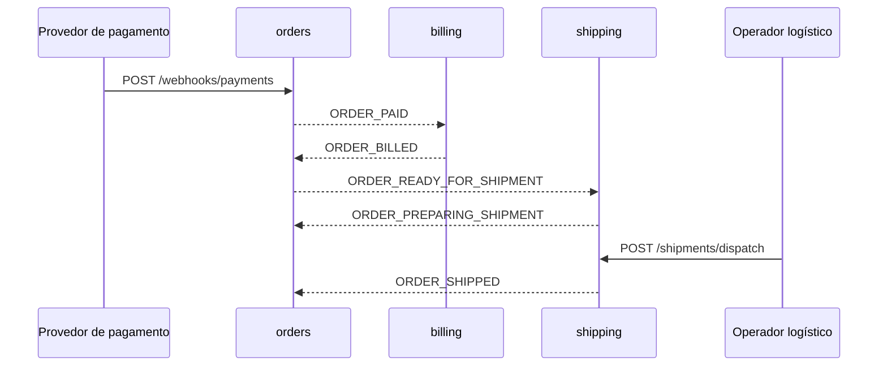

# Catálogo de eventos

## Convenções

Os eventos são publicados como `ProducerRecord<String, String>`:

- key: representação textual de `orderId`;
- value: objeto JSON serializado e congelado na criação da outbox;
- versão atual dos cinco contratos: `1`;
- sem Schema Registry, Avro ou JSON Schema versionado no repositório;
- entrega at-least-once.

Os nomes físicos dos tópicos não são constantes no código. Eles são fornecidos pelas variáveis `KAFKA_TOPIC_*`, que precisam ter valores coerentes nos serviços produtores e consumidores.

## Envelope Kafka

| Header | Obrigatoriedade | Origem |
|---|---|---|
| `event-id` | obrigatório | UUIDv7 da linha de outbox |
| `event-type` | obrigatório | tipo persistido da mensagem |
| `event-version` | obrigatório | versão positiva do contrato |
| `aggregate-type` | obrigatório | `ORDER`, `INVOICE` ou `SHIPMENT` |
| `aggregate-id` | obrigatório | identificador textual do agregado |
| `occurred-at` | obrigatório | instante do fato em ISO-8601 |
| `correlation-id` | obrigatório nas mensagens atuais | fluxo distribuído |
| `causation-id` | opcional | identidade do estímulo direto, quando conhecida |
| `content-type` | obrigatório | `application/json` |

`message_key` não é header: ela ocupa a key do registro Kafka.

## Visão do fluxo

O comando HTTP de despacho é um novo estímulo entre `ORDER_PREPARING_SHIPMENT` e `ORDER_SHIPPED`; o último evento não é produzido automaticamente pelo consumo do anterior.

## Matriz de eventos

| Evento | Variável do tópico | Produtor | Consumidor | Aggregate type | Causa usada pelo produtor |
|---|---|---|---|---|---|
| `ORDER_PAID` | `KAFKA_TOPIC_PAID_ORDERS` | `orders` | `billing` | `ORDER` | `webhookEventId` |
| `ORDER_BILLED` | `KAFKA_TOPIC_BILLED_ORDERS` | `billing` | `orders` | `INVOICE` | `event-id` de `ORDER_PAID` |
| `ORDER_READY_FOR_SHIPMENT` | `KAFKA_TOPIC_READY_FOR_SHIPMENT_ORDERS` | `orders` | `shipping` | `ORDER` | `event-id` de `ORDER_BILLED` |
| `ORDER_PREPARING_SHIPMENT` | `KAFKA_TOPIC_PREPARING_SHIPMENT_ORDERS` | `shipping` | `orders` | `SHIPMENT` | `event-id` de `ORDER_READY_FOR_SHIPMENT` |
| `ORDER_SHIPPED` | `KAFKA_TOPIC_SHIPPED_ORDERS` | `shipping` | `orders` | `SHIPMENT` | nula no código atual |

## `ORDER_PAID` v1

Publicado depois que o webhook confirma o pagamento e o pedido muda para `PAID`.

| Campo | Tipo | Observação |
|---|---|---|
| `orderId` | number | identificador positivo |
| `customer` | object | snapshot completo abaixo |
| `orderDate` | string | instante ISO-8601 |
| `orderTotal` | number | total não negativo |
| `orderObservations` | string/null | observação opcional |
| `orderItems` | array | um ou mais itens |

`customer`:

| Campo | Tipo |
|---|---|
| `customerId` | number |
| `fullName` | string |
| `nationalId` | string |
| `email` | string |
| `phoneNumber` | string |
| `postalCode` | string |
| `street` | string |
| `houseNumber` | string |
| `complement` | string/null |
| `neighborhood` | string/null |
| `city` | string |
| `state` | string |
| `country` | string |

Cada item de `orderItems` possui `productId`, `productName`, `amount` e `unitPrice`.

## `ORDER_BILLED` v1

Publicado depois que o PDF foi gerado, armazenado no MinIO e a nota mudou para `GENERATED`.

| Campo | Tipo | Observação |
|---|---|---|
| `orderId` | number | pedido faturado |
| `invoiceId` | string | UUID da nota |
| `billedAt` | string | instante ISO-8601 |
| `customer` | object | `customerId`, `fullName` e `email` |

`orders` desserializa os campos de pedido, nota e instante usados pelo seu caso de uso. O snapshot do cliente permanece no payload publicado.

## `ORDER_READY_FOR_SHIPMENT` v1

Publicado por `orders` na mesma transação em que o pedido muda para `BILLED`.

| Campo | Tipo | Observação |
|---|---|---|
| `orderId` | number | pedido faturado |
| `billedAt` | string | instante ISO-8601 |
| `customer` | object | `customerId`, `fullName` e `email` |

O snapshot permite a `shipping` criar a entrega e posteriormente enviar a confirmação sem consultar `customers`.

## `ORDER_PREPARING_SHIPMENT` v1

Publicado na criação idempotente de um `Shipment`.

| Campo | Tipo |
|---|---|
| `orderId` | number |

Ao consumir o evento, `orders` move um pedido `BILLED` para `PREPARING_SHIPMENT`. Uma reentrega para um pedido que já alcançou esse estado ou um estado posterior não repete a transição.

## `ORDER_SHIPPED` v1

Publicado quando `POST /shipments/dispatch` despacha uma entrega.

| Campo | Tipo | Observação |
|---|---|---|
| `orderId` | number | pedido enviado |
| `trackingCode` | string | código informado no despacho |
| `shippedAt` | string | instante informado ou gerado por `shipping` |

O evento registra o código em `orders`; não existe integração com API de transportadora para acompanhar movimentações.

## DLT e retentativas do consumidor

Cada consumidor declara uma DLT com sufixo `.DLT` para cada tópico que lê:

| Serviço | DLTs declaradas a partir de |
|---|---|
| `billing` | `KAFKA_TOPIC_PAID_ORDERS` |
| `shipping` | `KAFKA_TOPIC_READY_FOR_SHIPMENT_ORDERS` |
| `orders` | `KAFKA_TOPIC_BILLED_ORDERS`, `KAFKA_TOPIC_PREPARING_SHIPMENT_ORDERS`, `KAFKA_TOPIC_SHIPPED_ORDERS` |

As DLTs são declaradas com uma partição e uma réplica. O recoverer publica com partição `-1`; não pressupõe que a DLT tenha a mesma quantidade de partições do tópico de origem.

O handler faz quatro retentativas com intervalos exponenciais iniciando em um segundo e limitados a trinta segundos. Exceções classificadas como não retentáveis seguem diretamente para a DLT.
